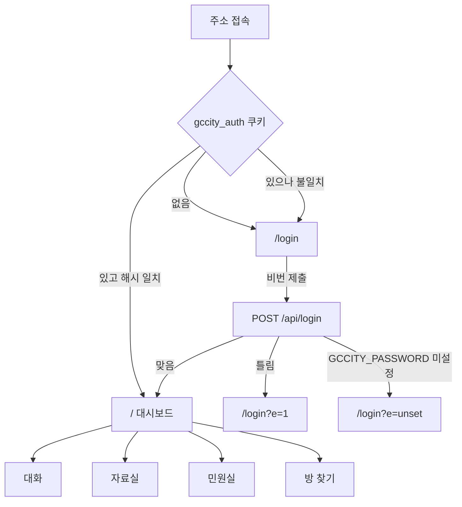
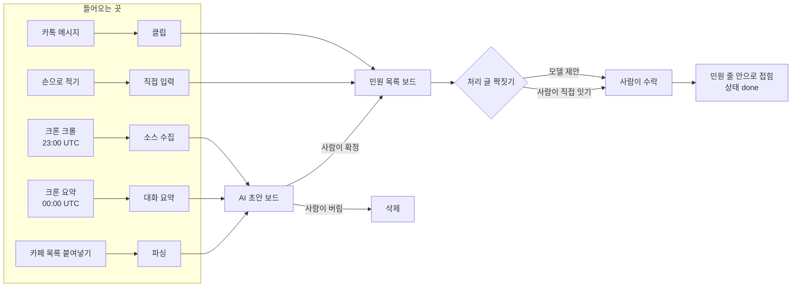

# SCREEN-001: gccity 콘솔 화면 구성도 (as-built)

- 대상: https://gccity.vercel.app
- 근거: `src/app/login/page.tsx` · `src/components/Dashboard.tsx` · `src/components/{tabs,civic,ui}/`
- 갱신: 2026-09-08 개편 반영
- 성격: 지금 화면에 있는 것을 그대로 옮긴 것이다. 앞으로 만들 화면이 아니다.

## 1. 목적·사용자

지역 활동가 1명이 여기 와서 하는 일 한 가지 — **흩어진 민원을 확정하고 기한 안에 처리됐는지 센다.**

## 2. 화면 라우트

Next.js 라우트는 2개뿐이다. 나머지는 전부 `Dashboard.tsx` 안의 상태 전환이다.

| 라우트 | 파일 | 인증 |
|---|---|---|
| `/login` | `src/app/login/page.tsx` | 없음 |
| `/` | `src/app/page.tsx` → `Dashboard.tsx` | 쿠키 필요 |

화면 코드는 탭별로 갈라져 있다. 예전에는 `Dashboard.tsx` 하나가 2571줄이었고 한 탭을 고치면
다른 탭이 함께 흔들렸다.

```
Dashboard.tsx            껍데기 — 상단바 · 탭 넷 · 3초 폴링          208줄
tabs/ChatTab.tsx         대화
tabs/VaultTab.tsx        자료실
tabs/FindTab.tsx         방 찾기
civic/CivicTab.tsx       민원실 — 보드 · 거르개 · 드로어 묶음         496줄
civic/StdBand.tsx        기준 준수 띠 + 숫자 넷 + 줄에 붙는 단계 칩
civic/ComplaintRow.tsx   민원 한 줄과 펼친 속살
civic/panels.tsx         드로어 안에 들어가는 다섯 가지
civic/CafeBox.tsx        카페 글 보관함
ui/                      Drawer · Empty · icons · Mark
```

## 3. 진입·이탈



이탈 경로는 둘이다 — 상단바 오른쪽 `나가기` 를 누르면 `/login` 으로 간다(쿠키는 그대로 남는다),
비번을 바꾸면 쿠키가 죽고 다음 요청에서 자동으로 돌아간다.

## 4. 상단 탭 4개

상태는 `useState<Tab>('civic')` — URL 에 안 실린다. 새로고침하면 `민원실` 로 돌아간다.

민원실이 **첫 탭**인 이유: 이 도구가 답하는 질문은 "이 민원이 기한 안에 처리됐는가" 이고
대화는 그 재료다. 열자마자 보여야 하는 것은 결론 쪽이다.

| 탭 | 값 | 화면에 있는 것 |
|---|---|---|
| 대화 | `chat` | 방 목록 · 선택한 방의 메시지 · 메시지를 민원으로 보내기 |
| 자료실 | `vault` | 첨부 파일 목록 · 올리기 · 내려받기 · 메모 |
| 민원실 | `civic` | 아래 5절 |
| 방 찾기 | `find` | 방 찾기 모드 켜기 · 새로 들어온 방 등록 · 봇 심박 |

## 5. 민원실 — 좌측 보드 3개

`CivicTab.tsx` — `type Board = 'list' | 'drafts' | 'cafe'`. 일이 흘러가는 차례대로 위에서 아래.



| 보드 | 부제 (실제 문구) | 무엇이 선다 |
|---|---|---|
| 민원 목록 | `N건 · 사람이 확정한 것` | `isListed` 통과분만 — 초안 아님 · 중복 아님 · 처리글 아님 |
| AI 초안 | `N건 · 카톡 N / 카페 N` | `ai_draft = true`. 확정 전이라 통계에 안 잡힌다 |
| 카페 글 | `N건 보관 · 붙여넣으면 요약한다` | 원문 보관함 |

`AI 초안` 건수는 거르개를 안 받는다. 목록에 출처 거르개를 걸어도 이 숫자는 안 변한다 (PRD-000 AC14).

## 6. 민원 목록 — 거르개와 패널

거르개 5축. 넷은 서버로 넘어가고 하나(`기한`)만 화면에서 자른다.

| 축 | 값 | 어디서 |
|---|---|---|
| 상태 | `all` `new` `doing` `done` `drop` | 서버 |
| 종류 | `all` `report` `resolution` `notice` `unknown` | 서버 |
| 출처 | `all` `chat` `paste` `crawl` `manual` | 서버 |
| 검색어 | 제목·메모·본문·분류 대상 부분일치 (260ms 디바운스) | 서버 |
| 기한 | `기준 전체` · `넘긴 것만` | **화면** |

`기한` 만 화면에서 자르는 이유: 늦었는지는 **지금 시각**에 달려 있어 서버 집계로 옮길 수 없다.
같은 행이 한 시간 뒤에 늦은 것이 된다. 그래서 이 거르개가 켜지면 준수율 띠는 거른 전체를
기준으로 남기고, **둘이 다른 것을 세고 있다고 화면에 적는다.** 숫자와 줄 수가 다른 것을
말없이 두지 않는다.

오른쪽에서 밀려 나오는 드로어 5종 (동시에 하나만):

| 값 | 무엇 |
|---|---|
| `paste` | 카페 목록 붙여넣기 |
| `manual` | 민원 직접 적기 |
| `stage` | 처리 단계 기록 — 배정·확인 시각을 사람이 적는다 |
| `sources` | 크롤 소스 등록·수정·삭제 |
| `authors` | 작성자 등록부 — 이 사람이 쓰면 처리 글 |

예전에는 이 내용이 목록 위에 인라인으로 펼쳐졌다. 그러면 열 때마다 아래 목록이 통째로 밀려
읽던 자리를 잃는다.

## 7. 처리 기준 준수 (민원실 상단)

띠 하나 + 숫자 넷. 띠는 `src/lib/sla.ts` 의 `STAGES` 를 그대로 그린다 — 단계를 고치면 여기가 따라온다.

| 단계 | 한도 | 무엇을 센다 |
|---|---|---|
| 1 담당자 배정 | 12시간 | 접수 → `assigned_at` |
| 2 현장 확인 | 36시간 | 접수 → `visited_at` |
| 3 처리 결과 회신 | 72시간 | 접수 → `resolved_at` |

각 칸에 비율과 **모수가 함께** 뜬다 — `80%` 옆에 언제나 `4 / 5건`. 80%가 5건 중 4건인지
100건 중 80건인지 모르면 그 숫자는 판단 근거가 못 된다.

**모수에 드는 것은 판정이 난 건뿐이다.** 아직 한도 안에서 기다리는 건은 성공도 실패도 아니라
세지 않는다. 실패로 세면 민원을 담을 때마다 준수율이 떨어지고, 성공으로 세면 늘 100%가 된다.

아래 숫자 넷: `확정 민원` · `기준 넘긴 건` · `평균 답변 소요(N건)` · `미분류`.

### 줄에 붙는 단계 칩

| 상태 | 언제 | 색 |
|---|---|---|
| `배정 10시간` | 한도 안 | 파랑 |
| `배정 11시간` | 한도의 80% 넘음 | 주황 |
| `배정 30시간` | 한도 넘김 | 빨강 |
| `배정 대기` | 기록 없고 한도 아직 | 회색 |
| `배정 기록 없음` | 기록 없는데 한도 지남 | **빨강** |

마지막 줄이 핵심이다. 기록이 빈 것을 무조건 `대기` 로 두면 열흘 묵은 민원이 영원히 대기로
남아 준수율에서 빠진다 — 이 레포가 제일 경계하는 조용한 통과가 그 모양이다.

단계 칩은 **민원(`report`)에만** 붙는다. 처리 글·공지·초안에는 접수부터 답변까지라는 개념이 없다.

## 8. 상태 4종

`design.md` 8절 기준.

| 상태 | 어떻게 |
|---|---|
| 기본 | 목록·표 |
| 로딩 | 스켈레톤(`Skeleton`). 스피너를 쓰지 않는다 — 레이아웃이 밀린다 |
| 에러 | `note bad` 로 본문 위에 남는다. 사유를 그대로 적는다 |
| 빈 상태 | `Empty` — 아이콘·제목·설명·**다음 행동 버튼** |

빈 상태에 다음 행동을 반드시 준다. 비어 있다는 사실만 적으면 사람이 막힌다.
거르개에 걸려 0건이면 `거르개 초기화` 가, 카페 글이 0건이면 `카페 글 넣기` 가 뜬다.

실패를 숨기지 않는 자리들 — 카페 글 줄의 `요약 실패` 배지, 크롤 소스의 마지막 실행 사유,
카톡 분석 실패 배너. 0건인 것과 아예 안 돌아간 것은 겉보기가 같아서 갈라 적어야 한다.

## 9. 권한

사용자 구분이 없다. 로그인하면 전 데이터에 읽기·쓰기가 된다. 화면에 권한으로 가려지는 요소가 0개다.

## 10. 접근성·반응형

- 드로어: `role="dialog"` · `aria-modal` · ESC·배경 클릭으로 닫힘 · 열려 있는 동안 뒤 화면 스크롤 잠금
- 줄 펼침 버튼에 `aria-expanded`, 상태·종류 셀렉트에 `aria-label`
- 색만으로 정보를 전하지 않는다 — 단계 칩에 글자가 함께 있다
- 브레이크포인트 하나: **900px**

| 900px 아래 | 어떻게 |
|---|---|
| 왼쪽 보드 | 숨기지 않고 **가로로 눕혀 스크롤**한다 — 거기서만 가는 곳(카페 목록 붙여넣기·크롤 소스)이 사라지지 않게 |
| 상단바 | 이름은 앞 낱말만, 봇 상태는 숨긴다(같은 값이 `방 찾기` 탭에 있다) |
| 통계 | 4칸 → 2칸, 기준 띠 3칸 → 1칸 |
| 드로어 | 화면 전체 폭 |
| `민원으로` 버튼 | 항상 보인다 — 터치에는 hover 가 없다 |

아직 안 한 것: 포커스 트랩, 라이브리전.

## 11. 토큰

`src/styles/tokens.css` 가 색·간격·radius·타이포의 유일한 출처다. 컴포넌트에 hex 리터럴·임의 px 를
적지 않는다. 새 값이 필요하면 토큰을 더한다.

의미색은 3톤이다 — 면(`--red`) / 연한 배경(`--red-sf`) / 글자(`--red-tx`). 면 색을 글자에 쓰면
대비가 무너지므로 상태 글자에는 반드시 `-tx` 쪽을 쓴다.

다크모드는 **명시적으로 안 한다** (`color-scheme: light only`). 어중간한 미구현을 남기지 않는다.
