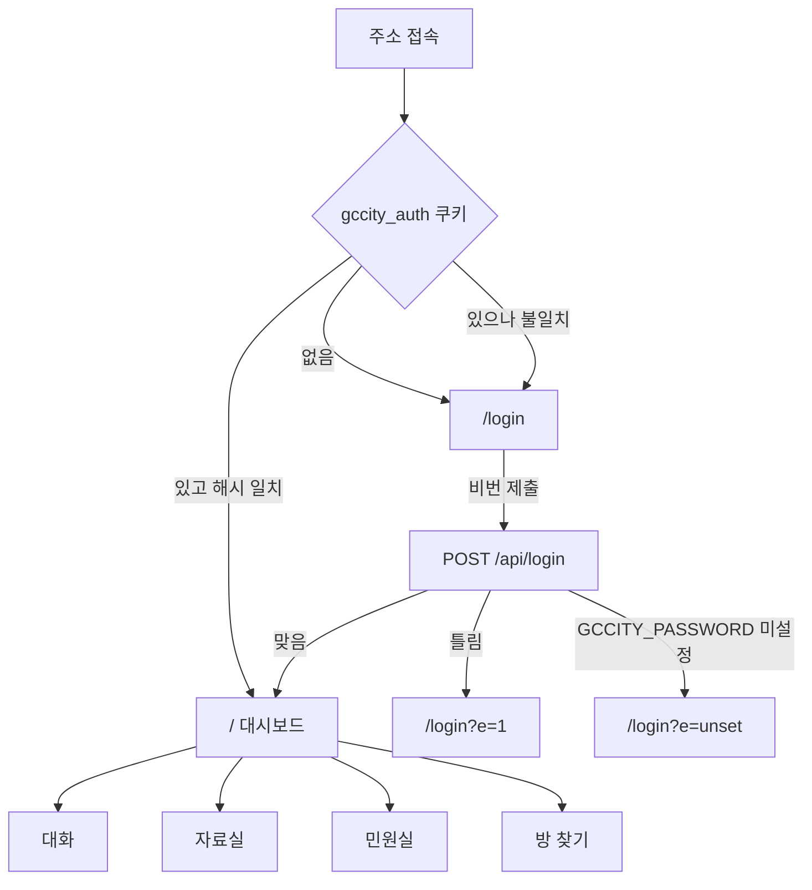
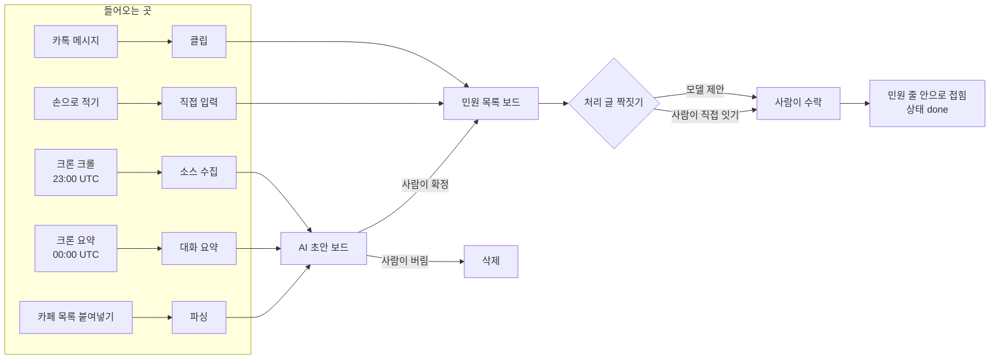

# SCREEN-001: gccity 콘솔 화면 구성도 (as-built)

- 대상: https://gccity.vercel.app
- 근거: `src/app/page.tsx` · `src/app/login/page.tsx` · `src/components/Dashboard.tsx`
- 성격: 지금 화면에 있는 것을 그대로 옮긴 것이다. 앞으로 만들 화면이 아니다.

## 1. 목적·사용자

과천시 지역 활동가 1명이 여기 와서 하는 일 한 가지 — **흩어진 민원을 확정하고 처리됐는지 센다.**

## 2. 화면 라우트

Next.js 라우트는 2개뿐이다. 나머지는 전부 `Dashboard.tsx` 안의 상태 전환이다.

| 라우트 | 파일 | 인증 |
|---|---|---|
| `/login` | `src/app/login/page.tsx` | 없음 |
| `/` | `src/app/page.tsx` → `Dashboard.tsx` | 쿠키 필요 |

## 3. 진입·이탈

이탈 경로는 하나뿐이다 — 비번을 바꾸면 쿠키가 죽고 다음 요청에서 `/login` 으로 돌아간다. 로그아웃 버튼은 없다.

## 4. 상단 탭 4개

`Dashboard.tsx:229-232`. 상태는 `useState<'chat'|'find'|'vault'|'civic'>('chat')` — URL 에 안 실린다. 새로고침하면 `대화` 로 돌아간다.

| 탭 | 값 | 화면에 있는 것 |
|---|---|---|
| 대화 | `chat` | 방 목록 · 선택한 방의 메시지 · 메시지를 민원으로 보내기 |
| 자료실 | `vault` | 첨부 파일 목록 · 올리기 · 내려받기 · 메모 |
| 민원실 | `civic` | 아래 5절 |
| 방 찾기 | `find` | 방 찾기 모드 켜기 · 새로 들어온 방 등록 · 봇 심박 |

## 5. 민원실 — 좌측 보드 3개

`Dashboard.tsx:1139` — `type Board = 'list' | 'drafts' | 'cafe'`. 일이 흘러가는 차례대로 위에서 아래.

| 보드 | 부제 (실제 문구) | 무엇이 선다 |
|---|---|---|
| 민원 목록 | `N건 · 사람이 확정한 것` | `isListed` 통과분만 — 초안 아님 · 중복 아님 · 처리글 아님 |
| AI 초안 | `N건 · 카톡 N / 카페 N` | `ai_draft = true`. 확정 전이라 통계에 안 잡힌다 |
| 카페 글 | `N건 보관 · 붙여넣으면 요약한다` | 원문 보관함 |

`AI 초안` 건수는 거르개를 안 받는다. 목록에 출처 거르개를 걸어도 이 숫자는 안 변한다 (PRD-000 AC14).

## 6. 민원 목록 — 거르개와 패널

거르개 4축, 전부 서버로 넘어간다 (`Dashboard.tsx:1174-1177`).

| 축 | 값 |
|---|---|
| 상태 | `all` `new` `doing` `done` `drop` |
| 종류 | `all` `report` `resolution` `notice` `unknown` |
| 출처 | `all` `chat` `cafe` |
| 검색어 | 제목·메모·본문·분류 대상 부분일치 |

겹쳐 뜨는 패널 4종 (`panel` 상태, 동시에 하나만):

| 값 | 무엇 |
|---|---|
| `none` | 기본 |
| `paste` | 카페 목록 붙여넣기 |
| `sources` | 크롤 소스 등록·수정·삭제 |
| `authors` | 작성자 등록부 — 이 사람이 쓰면 처리 글 |

## 7. 흐름 요약 (민원실 상단)

4칸. 세 번째 칸 라벨에 **모수가 붙는다** — `평균 (N건 기준)`.

| 칸 | 값 |
|---|---|
| 민원 | 확정 민원 건수 |
| 처리 | 짝이 지어진 건수 |
| 평균 (N건 기준) | 접수→처리 소요일수 |
| 당일 처리 | 같은 날 처리된 건수 |

모수를 같이 적는 이유는 화면에 주석으로 적혀 있다 — 평균 3일이 2건에서 나왔는지 100건에서 나왔는지 모르면 그 숫자는 판단 근거가 못 된다.

## 8. 상태 4종

`design.md` 8절 기준. 현재 구현 상태를 있는 그대로 적는다.

| 상태 | 현재 |
|---|---|
| 기본 | 있다 |
| 로딩 | 부분적 — 재조회 중 표시가 보드마다 다르다 |
| 에러 | 부분적 — `act()` 응답의 `error` 를 띄우는 곳과 조용히 넘어가는 곳이 섞여 있다 |
| 빈 상태 | 부분적 — 보드별로 있는 곳과 없는 곳이 섞여 있다 |

세 개가 `부분적`인 것은 결함이다. `Dashboard.tsx` 2571줄 분해 때 보드 단위로 채우는 것이 맞다.

## 9. 권한

사용자 구분이 없다. 로그인하면 전 데이터에 읽기·쓰기가 된다. 화면에 권한으로 가려지는 요소가 0개다.

## 10. 접근성·반응형

현재 다루지 않는 것 — 포커스 순서 지정 없음, 라이브리전 없음, 브레이크포인트별 레이아웃 정의 없음. `design.md` 기준으로는 미달이고, 사용자가 1명·데스크톱 1대라 지금까지 문제로 드러나지 않았다.

## 11. 토큰

`tokens.css` 가 없다. 색·간격이 컴포넌트에 직접 적혀 있다. `design.md` 1절 위반 — 개방(PRD-001) 전에 정리 대상.
