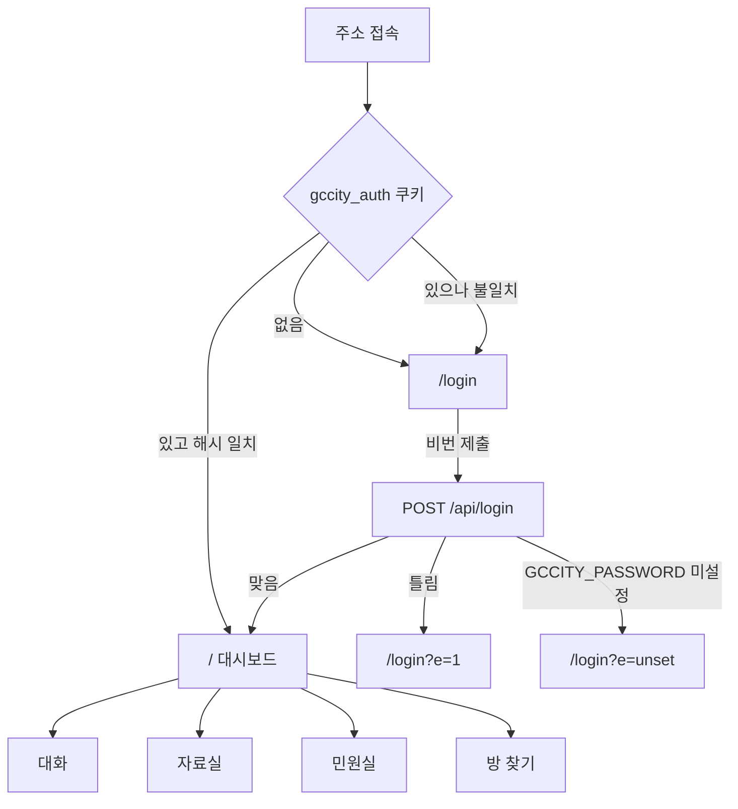
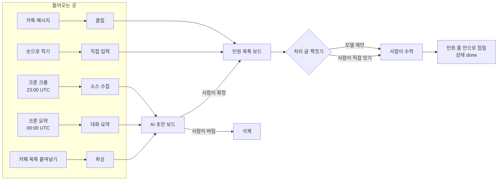

# gccity 문서 모음

- 묶은 날: 2026-09-08
- 대상: https://gccity.vercel.app
- 레포: https://github.com/ehdrb1023/gccity

이 파일 하나에 네 문서가 순서대로 들어 있다. 원본은 레포의 아래 경로에 따로 있다.

| # | 문서 | 원본 경로 | 무엇 |
|---|---|---|---|
| 1 | PRD-000 | `docs/prd/PRD-000-as-built.md` | 지금 도는 서비스를 코드에서 역으로 뽑은 기준선 |
| 2 | SCREEN-001 | `docs/design/screens/SCREEN-001-console.md` | 현재 화면 구성도 (mermaid 흐름도 2개) |
| 3 | ADR-001 | `docs/adr/ADR-001-multi-tenant.md` | 단일 사용자 원칙을 버리는 결정과 근거 |
| 4 | PRD-001 | `docs/prd/PRD-001-multi-tenant.md` | 여러 사람이 각자 쓰게 여는 변경 |

읽는 순서는 위에서 아래다. 1·2 는 현재, 3 은 결정, 4 는 앞으로.

## 지금 상태 한 장 요약

| 축 | 현재 |
|---|---|
| 사용자 | 1명. 비밀번호 1개를 아는 사람 전부가 같은 화면 |
| 수집 | 폰의 MessengerBotR 이 카톡 알림을 읽어 서버로. 읽기 전용 |
| 자동 실행 | 크론 2개 — 23:00 UTC 소스 크롤, 00:00 UTC 대화 요약 |
| 모델 | `claude-opus-5`. 대화 요약·카페 글 요약·짝 제안 세 곳 |
| 확정 | 전부 사람 클릭. 모델이 상태를 바꾸지 않는다 |
| 처리 기준 | 3단계 — 배정 12h · 확인 36h · 답변 72h. `src/lib/sla.ts` 의 `STAGES` 한 곳에서 고친다 |
| 화면 | Next.js 라우트 2개(`/login`, `/`). 탭별로 파일이 갈려 있다 |
| 테이블 | 10종. 소유자 컬럼 0개, 인가 검사 있는 라우트 0개 |
| 지역 의존 | 없다. 기관 이름은 `CIVIC_OFFICE_NAMES` 로 뺀다 |

## 미해결 위험 — 중요한 순서

1. 카톡 원문이 마스킹·고지 없이 Anthropic 으로 나간다. 처리 위탁·국외 이전 고지 의무
2. 처리방침 문서가 없다. 개인정보 처리 시 공개 의무
3. 로그인에 레이트리밋·계정 잠금이 없다
4. 목록 300건 / 집계 5000건. 민원 300건을 넘기면 칩 숫자와 목록이 어긋난다
5. 배정·확인 시각을 사람이 손으로 적는다 — 안 적으면 준수율 모수가 얇다 (의도한 설계)

---
---


<!-- ===== prd/PRD-000-as-built.md ===== -->

# PRD-000: gccity 현재 서비스 (as-built)

- 상태: shipped
- 복잡도: H
- 작성: 2026-09-07 (개편 반영 2026-09-08)
- 성격: 앞으로 만들 것이 아니라 **지금 돌고 있는 것**을 코드에서 역으로 뽑은 기준선 문서다.
  번호를 000 으로 둔 이유 — PRD-001 이후는 이 기준선 위에 얹히는 변경이다.
- 배포: https://gccity.vercel.app

## 1. 문제

지역 민원이 세 곳에 흩어져 있고 서로 이어지지 않는다. (과천에서 출발했지만 코드에 지역이 박혀 있지 않다 — 11절 참조)

| 흩어진 곳 | 문제 |
|---|---|
| 카카오톡 오픈채팅방 | 스크롤이 지나가면 사라진다. 검색이 안 된다. 사진은 만료된다 |
| 네이버 카페 게시판 | 민원 글과 처리 결과 글이 따로 올라오고 짝이 안 지어진다 |
| 기관 게시판 | 답변이 언제 달렸는지 세는 사람이 없다 |

그래서 "이 민원이 접수된 지 며칠 됐는지", "기한 안에 처리됐는지" 를 아무도 숫자로 못 댄다.
겪는 사람: 지역 활동가 1명(현재 유일 사용자).

## 2. 목표

- G1. 카톡·카페·기관 게시판의 민원을 한 곳에 모으고 사라지지 않게 보관한다
- G2. 접수부터 답변까지를 단계로 나눠 **기한 준수를 숫자로** 낸다
- G3. 모델은 초안만 내고 확정은 사람이 한다 — 통계에 추정치가 섞이지 않게

## 3. 비목표

- N1. 카톡에 글을 쓰지 않는다. 봇은 읽기 전용이다
- N2. 기관 게시판·카페에 자동 등록·자동 답변을 하지 않는다
- N3. 여러 사람이 쓰지 않는다. 워크스페이스·계정 개념이 없다 (개방은 PRD-001)
- N4. 모델이 민원 상태를 바꾸지 않는다. `new/doing/done/drop` 전이는 전부 사람 클릭이다
- N5. 실시간이 아니다. 크롤·요약은 하루 1회 크론이다
- N6. 모바일 전용 화면을 따로 만들지 않는다. 한 화면이 900px 아래에서 접힌다
- N7. 단계 시각을 모델이 채우지 않는다. 배정·확인은 사람이 적고, 답변은 회신문에서 규칙이 뽑는다

## 4. 사용자 흐름

### 수집 (사람 개입 없음)
1. 폰의 MessengerBotR 이 카톡 알림을 받는다
2. 봇이 `chat.channelId` 로 **팔로우 중인 방인지 먼저 확인**한다. 아니면 본문을 만들지도 않고 버린다
3. 팔로우 방이면 `POST /api/bot/ingest` 로 보낸다 (`GCCITY_INGEST_TOKEN`)
4. 서버가 `msg_id` 로 멱등 처리한다 — 같은 메시지가 두 번 와도 1줄
5. 토큰이 없거나 틀리면 401 이고 아무것도 안 들어간다

### 민원 만들기 — 세 갈래
| 갈래 | 방법 |
|---|---|
| 카톡에서 | 대화 화면에서 메시지를 골라 `민원으로` 를 누른다 (`clip`) |
| 카페 글에서 | 목록을 통째로 붙여넣으면 파싱해서 초안으로 쌓는다 (`paste`) |
| 손으로 | 제목·본문을 직접 적는다 (`manual`) |

### AI 초안 → 확정
1. 크론(매일 23:00 UTC)이 등록된 시청·카페 소스를 크롤한다
2. 크론(매일 00:00 UTC)이 카톡 대화를 요약해 민원 후보를 뽑는다
3. 후보는 `ai_draft = true` 로 들어간다 — 목록·통계에 **안 잡힌다**
4. 사람이 `AI 초안` 보드에서 확인하고 확정을 누르면 목록에 올라온다
5. 아니면 지운다

### 처리 글 잇기
1. 모델이 "이 처리 글은 저 민원 같다" 를 제안한다 (`suggestPairs`)
2. 사람이 수락하면 처리 글이 민원 줄 안으로 접히고 상태가 `done` 이 된다
3. 거절하면 짝이 안 된다. 모델 제안만으로는 아무것도 안 바뀐다
4. 손으로도 이을 수 있다 — 민원 줄의 `[여기에 잇기]`

### 실패 경로
- 봇 설정 없음 → `/api/bot/config` 가 빈 목록을 준다. 봇은 아무 방도 안 따라간다 (fail-closed)
- `CRON_SECRET` 불일치 → 크론 라우트 401. 수집이 멈춘다
- `ANTHROPIC_API_KEY` 없음 → 요약·짝짓기가 에러를 던진다. 수집·목록은 계속 돈다
- 카톡 사진 URL 만료 → 만료 전에 서버가 받아 Supabase Storage 에 옮긴다 (`expireStalePreviews`)

## 5. 요구사항 (구현됨)

### 수집
- R1. 봇은 `chat.channelId` 하나만 방 판별 축으로 쓴다. 방 이름은 바뀌므로 쓰지 않는다
- R2. 멱등 키는 `log:<chat.logId>` 우선, 없으면 `msg:<ms>:<md5>`, 그것도 없으면 `fb:<sec>:<md5>`. `(room_id, msg_id)` 유니크
- R3. 봇은 팔로우 확인을 **본문 만들기 전에** 한다. 서버도 같은 순서로 검사한다
- R4. 보낸 사람 이름은 알림의 `sender_person` 을 먼저 보고, 없으면 `chat.author.name` 을 쓴다 (후자는 값이 굳는다)
- R5. `bot/*.js` 는 Rhino ES5 다 — 화살표 함수·`let`·`const`·템플릿 리터럴 금지

### 민원
- R6. 상태 4종: `new` `doing` `done` `drop`. 전이는 사람만
- R7. 종류 4종: `report`(민원) `resolution`(처리) `notice`(공지) `unknown`. 제목의 날짜 규칙이 작성자 등록부보다 우선
- R8. `kind_locked` 가 켜진 글은 재분류가 덮어쓰지 않는다
- R9. 목록에 서는 조건 = `ai_draft` 아님 AND 중복 아님 AND 처리글 아님 — `src/lib/complaint-view.ts:isListed` 한 곳에만 있다
- R10. 처리 글 본문에서 담당부서·기관·기한을 **정규식으로** 뽑는다 (`parseResolutionBody`). 모델을 쓰지 않는다

### 크롤
- R11. `robots.txt` 의 `Disallow` 를 지킨다 (`robotsDisallows`)
- R12. 소스별 키워드 대조 후 걸리는 글만 저장한다
- R13. RSS 와 HTML 목록 둘 다 파싱한다

### 처리 단계 (2026-09-08)
- R14. 단계와 한도는 `src/lib/sla.ts` 의 `STAGES` 한 곳에만 있다. 기본 3단계 — 배정 12시간 · 확인 36시간 · 답변 72시간
- R15. 배정·확인 시각은 사람이 [단계 기록] 으로 적는다. 답변 시각은 회신문에서 규칙이 뽑는다. **모델이 채우지 않는다**
- R16. 기록이 비었는데 한도가 지났으면 `대기` 가 아니라 **늦음**이다
- R17. 준수율 모수에서 아직 한도 안에서 기다리는 건은 뺀다. 성공도 실패도 아니다

### 통계
- R18. 준수율에 **모수를 함께 적는다** — `80% · 4/5건`
- R19. 소요 시간은 접수 → 각 단계. 접수일이 없으면 어느 쪽으로도 세지 않는다

### 화면 (2026-09-08 개편)
- R20. 색·간격·타이포는 `src/styles/tokens.css` 에서만 온다. 컴포넌트에 hex·임의 px 금지
- R21. 다크모드를 **명시적으로 안 한다** (`color-scheme: light only`)
- R22. 데이터를 보여주는 곳은 로딩(스켈레톤)·에러·빈 상태 셋을 전부 갖는다
- R23. 900px 아래에서 왼쪽 보드를 숨기지 않고 가로로 눕힌다 — 거기서만 가는 곳이 사라지지 않게

### 인증
- R24. 비밀번호 1개. 쿠키는 `SHA-256('gccity|v1|' + 비번)` 상수. 비번을 바꾸면 기존 쿠키가 전부 죽는다
- R25. `/api/bot/` `/api/cron/` 은 미들웨어를 통과하고 **라우트가 직접** 토큰·시크릿을 검사한다

## 6. 수용 기준 (현재 동작 = 회귀 기준선)

### 인증
- AC1. 쿠키 없이 `GET /` 를 부르면 307 로 `/login` 에 보낸다
- AC2. 쿠키 없이 `GET /api/complaints` 를 부르면 401 과 `{ok:false, reason:'unauthorized'}` 다
- AC3. `POST /api/login` 에 틀린 비번을 폼으로 보내면 303 으로 `/login?e=1` 에 보낸다
- AC4. 맞는 비번이면 303 으로 `/` 에 보내고 `gccity_auth` 쿠키를 굽는다 (`httpOnly` `secure` `sameSite=lax`, 30일)
- AC5. `GCCITY_PASSWORD` 가 비어 있으면 303 으로 `/login?e=unset` 에 보낸다 — 통과시키지 않는다

### 수집
- AC6. 토큰 없이 `POST /api/bot/ingest` 를 부르면 401 이고 `messages` 행이 안 는다
- AC7. 같은 `(room_id, msg_id)` 로 두 번 보내면 `messages` 행이 1개다
- AC8. 팔로우하지 않는 `channelId` 로 보내면 저장되지 않는다
- AC9. 봇 설정이 없으면 `GET /api/bot/config` 가 빈 방 목록을 준다 (fail-closed)
- AC10. `CRON_SECRET` 없이 `GET /api/cron/digest` 를 부르면 401 이다

### 민원 목록
- AC11. `ai_draft = true` 인 글은 `GET /api/complaints` 응답의 `complaints` 에 없다
- AC12. 상태별 칩 숫자를 전부 더하면 목록 줄 수와 같다 (`src/lib/complaint-view.test.ts`)
- AC13. `duplicate_of` 또는 `resolution_of` 가 채워진 글은 목록에 없다
- AC14. 출처(`origin`) 거르개를 카톡으로 바꿔도 좌측 `AI 초안` 건수는 안 바뀐다 — 초안 집계는 거르개를 안 받는다

### 분류
- AC15. 제목이 `[2026-08-12] ...` 형태면 작성자 등록부가 뭐라 하든 그 날짜를 접수일로 쓴다
- AC16. `kind_locked` 인 글에 `reclassify` 를 돌려도 `kind` 가 안 바뀐다
- AC17. 처리 글 본문에 `담당부서: 도시과` 가 있으면 `parseResolutionBody` 가 `도시과` 를 뽑는다

### 짝짓기
- AC18. 모델이 짝을 제안해도 사람이 수락하기 전에는 `complaints.resolution_of` 가 null 이다
- AC19. 수락하면 처리 글의 `resolution_of` 가 민원 ID 가 되고 민원 상태가 `done` 이 된다

### 크롤
- AC20. `robots.txt` 가 그 경로를 `Disallow` 하면 요청하지 않는다
- AC21. 소스의 키워드에 안 걸리는 글은 저장되지 않는다

### 처리 단계 (2026-09-08)
- AC22. 접수 후 5시간 지난 민원에 배정 기록이 없으면 배정 칩이 `대기` 다 (한도 12시간)
- AC23. 접수 후 100시간 지난 민원에 배정 기록이 없으면 배정 칩이 `늦음` 이다 — 대기로 숨기지 않는다
- AC24. 한도 안에서 기다리는 건만 있는 표본의 준수율은 `0 / 0건` 이고 나눗셈이 터지지 않는다
- AC25. 접수일이 없는 민원은 준수율 분자·분모 어느 쪽에도 들어가지 않는다
- AC26. `POST /api/complaints` 에 `action=stage`, `at=''` 를 보내면 그 단계 기록이 null 로 지워진다
- AC27. `넘긴 것만` 거르개를 켜면 목록만 좁아지고 준수율 띠는 거른 전체를 기준으로 남는다. 둘이 다른 것을 센다고 화면에 적힌다

### 화면 (2026-09-08 개편)
- AC28. `/` 는 `민원실` 탭으로 열린다
- AC29. 로딩 중 민원 목록 자리에 스켈레톤이 뜨고 레이아웃이 밀리지 않는다
- AC30. 거르개에 걸려 0건이면 `거르개 초기화` 버튼이 뜬다 — 빈 화면만 두지 않는다
- AC31. 드로어는 ESC 와 배경 클릭으로 닫히고, 열려 있는 동안 뒤 화면이 스크롤되지 않는다
- AC32. 390px 폭에서 상단바가 한 줄이고 왼쪽 보드가 가로로 스크롤된다

## 7. 데이터·계약

### 테이블 (9종, `supabase/migrations/0001`~`0014`)
| 테이블 | 무엇 |
|---|---|
| `rooms` | 카톡 방. `channel_id` 가 판별 축, `followed` 가 수집 여부 |
| `messages` | 카톡 원문. `(room_id, msg_id)` 유니크 |
| `files` | 자료실 첨부. Supabase Storage 경로 |
| `complaints` | 민원·처리·공지 글 전부. `kind` `status` `ai_draft` `duplicate_of` `resolution_of` `assigned_at` `visited_at` `resolved_at` |
| `complaint_authors` | 작성자 등록부 — 이 사람이 쓰면 대체로 처리 글이다 |
| `complaint_sources` | 크롤 대상(기관·카페 게시판) + 키워드 |
| `complaint_pairs` | 민원↔처리 짝 제안·수락 기록 |
| `cafe_posts` | 붙여넣은 카페 글 보관 |
| `digest_runs` | 요약 크론 실행 기록 |
| `app_state` | 전역 1행 (`check (id = 1)`) — 방 찾기 모드, 설정 버전, 봇 심박 |

RLS 는 전 테이블 켜져 있고 정책은 0개다. 서버가 service-role 로만 붙는다.

### API (10개 라우트)
| 경로 | 메서드 | 인증 | 무엇 |
|---|---|---|---|
| `/api/login` | POST | 없음 | 폼 비번 검사 → 쿠키 |
| `/api/complaints` | GET/POST | 쿠키 | 조회 + 14개 동작 (`paste` `manual` `clip` `body` `status` `edit` `delete` `author-kind` `author-delete` `reclassify` `kind` `link` `unlink`) |
| `/api/rooms` | POST | 쿠키 | `add` `follow` `unfollow` `rename` `delete` `discovery` |
| `/api/files` | GET/POST | 쿠키 | `sign` `confirm` `download` `note` |
| `/api/state` | GET | 쿠키 | 방 찾기 모드·봇 심박 |
| `/api/bot/config` | GET | 봇 토큰 | 팔로우 방 목록 + 설정 버전 |
| `/api/bot/ingest` | POST | 봇 토큰 | 메시지 저장 |
| `/api/bot/photo` | POST | 봇 토큰 | 사진 저장 |
| `/api/cron/complaints` | GET | `CRON_SECRET` | 소스 크롤 |
| `/api/cron/digest` | GET | `CRON_SECRET` | 대화 요약 → 초안 |

### 크론 (`vercel.json`)
| 시각(UTC) | 경로 |
|---|---|
| `0 23 * * *` | `/api/cron/complaints` |
| `0 0 * * *` | `/api/cron/digest` |

### 모델
`claude-opus-5` (`GCCITY_DIGEST_MODEL` 로 덮어쓸 수 있다). 세 곳에서 부른다 — `digest.ts`(대화 요약), `cafe.ts`(카페 글 요약), `pair.ts`(짝 제안). 전부 `zodOutputFormat` 으로 구조화 출력을 강제한다.

## 8. 비기능

### 권한 규칙
| 주체 | 가능 | 불가 |
|---|---|---|
| 미로그인 | `/login` `/api/login` | 그 외 전부 (API 401, 화면 `/login`) |
| 로그인 사용자 | 전 데이터 읽기·쓰기 | 없음 — 권한 구분이 없다 |
| 봇 (`GCCITY_INGEST_TOKEN`) | 방 목록 읽기, 메시지·사진 쓰기 | 민원·파일 읽기, 설정 변경 |
| 크론 (`CRON_SECRET`) | 크롤·요약 실행 | — |

사용자가 1명이라 사용자 간 권한 구분이 존재하지 않는다. 이것이 PRD-001 의 출발점이다.

### 성능
- Vercel `icn1`(서울). 무거운 라우트에 `maxDuration = 300`
- 목록 조회 상한 300건, 집계 상한 5000건 — **300건을 넘기면 칩 숫자와 목록이 다시 어긋난다** (`src/server/complaints.ts` 주석에 적혀 있다)

### 접근성·반응형 (2026-09-08)
- 드로어는 ESC·배경 클릭으로 닫히고 `role="dialog"` `aria-modal` 을 갖는다. 열려 있는 동안 뒤 화면 스크롤을 잠근다
- 줄 펼침 버튼에 `aria-expanded`, 상태·종류 셀렉트에 `aria-label` 이 붙는다
- 색만으로 상태를 전하지 않는다 — 칩에 글자가 함께 있다 (`배정 10시간` · `배정 기록 없음`)
- 브레이크포인트는 900px 하나다. 그 아래에서 왼쪽 보드가 가로로 눕고 상단바의 봇 상태는 숨는다(같은 값이 `방 찾기` 탭에 있다)
- 아직 안 한 것: 포커스 트랩, 라이브리전. 사용자가 1명이라 드러나지 않았다

### 개인정보
- 카톡 원문에 대화 참여자의 이름·연락처·주소가 그대로 들어온다
- 요약을 위해 원문이 Anthropic API 로 나간다 — 처리 위탁·국외 이전에 해당한다. 현재 마스킹도 고지도 없다 (미해결)
- 처리방침 문서 자체가 없다

## 9. 위험 (현재 남아 있는 것)

| 위험 | 영향 | 현재 상태 |
|---|---|---|
| 비번 1개 공유 | 주소를 아는 사람이 전부 본다 | 미해결 — PRD-001 |
| 로그인 레이트리밋·잠금 없음 | 무차별 대입 | 미해결 — PRD-001 R1 |
| 카톡 원문이 마스킹 없이 모델로 나감 | 개인정보 위탁 고지 의무 위반 소지 | 미해결 |
| 처리방침 부재 | 개인정보 처리 시 공개 의무 위반 소지 | 미해결 |
| 목록 300 / 집계 5000 불일치 | 민원 300건 넘으면 칩과 목록이 어긋난다 | 코드 주석에 명시, 미수정 |
| 배정·확인 시각을 사람이 손으로 적는다 | 안 적으면 준수율 모수가 얇다. 적기를 잊으면 늦음으로 잡힌다 | 의도한 설계 — 모델이 채우면 통계가 거짓이 된다 |
| 단계 한도 12/36/72가 기관 기준과 다를 수 있다 | 준수율이 그 기관 기준과 안 맞는다 | `src/lib/sla.ts` 의 `STAGES` 한 곳에서 고친다 |
| 봇이 401 을 조용히 삼킴 | 수집이 멈춰도 화면은 멀쩡하다 | `app_state.bot_last_seen_at` 심박으로 관측 |

## 10. 롤백

이 문서는 코드 변경이 아니라 기준선 기록이다. 되돌릴 것이 없다.
운영 롤백은 Vercel 이전 배포로 되돌리는 것이고, DB 는 Supabase 자동 백업 시점으로 복구한다.

## 11. 추적성

| 요구 | 수용 기준 |
|---|---|
| R1, R3 | AC8 |
| R2 | AC7 |
| R6 | AC18, AC19 |
| R7 | AC15 |
| R8 | AC16 |
| R9 | AC11, AC12, AC13, AC14 |
| R10 | AC17 |
| R11 | AC20 |
| R12 | AC21 |
| R14 | AC22, AC23 |
| R15 | AC26 |
| R16 | AC23 |
| R17 | AC24, AC25 |
| R18 | AC24 |
| R19 | AC25 |
| R20~R23 | AC28, AC29, AC30, AC31, AC32 |
| R24 | AC3, AC4, AC5 |
| R25 | AC1, AC2, AC6, AC9, AC10 |
| 단계 판정이 지금 시각에 달림 | AC27 |

## 12. 지역 의존 (2026-09-08)

과천에서 출발했지만 지역 이름이 코드에 박혀 있지 않다.

| 자리 | 어떻게 |
|---|---|
| 회신문에서 부서를 뽑는 기관 이름 | `CIVIC_OFFICE_NAMES` (쉼표 구분). 비우면 한국 지자체 일반형 |
| 모델 프롬프트 | 지역 이름 없음 (`cafe.ts` · `digest.ts` · `pair.ts`) |
| 화면 이름·마크 | `민원 콘솔` + 중립 마크. 기관 상징 안 씀 |
| 단계·한도 | `src/lib/sla.ts` 의 `STAGES` |
| 테스트 픽스처 | **과천 실측 데이터를 그대로 둔다.** 규칙이 왜 그런지의 근거다. 다른 지자체 회신문 테스트를 나란히 둬 한 도시에만 맞는 규칙으로 굳는 것을 막는다 |


---
---


<!-- ===== design/screens/SCREEN-001-console.md ===== -->

# SCREEN-001: gccity 콘솔 화면 구성도 (as-built)

- 대상: https://gccity.vercel.app
- 근거: `src/app/login/page.tsx` · `src/components/Dashboard.tsx` · `src/components/{tabs,civic,ui}/`
- 갱신: 2026-09-08 개편 반영
- 성격: 지금 화면에 있는 것을 그대로 옮긴 것이다. 앞으로 만들 화면이 아니다.

## 1. 목적·사용자

지역 활동가 1명이 여기 와서 하는 일 한 가지 — **흩어진 민원을 확정하고 기한 안에 처리됐는지 센다.**

## 2. 화면 라우트

Next.js 라우트는 2개뿐이다. 나머지는 전부 `Dashboard.tsx` 안의 상태 전환이다.

| 라우트 | 파일 | 인증 |
|---|---|---|
| `/login` | `src/app/login/page.tsx` | 없음 |
| `/` | `src/app/page.tsx` → `Dashboard.tsx` | 쿠키 필요 |

화면 코드는 탭별로 갈라져 있다. 예전에는 `Dashboard.tsx` 하나가 2571줄이었고 한 탭을 고치면
다른 탭이 함께 흔들렸다.

```
Dashboard.tsx            껍데기 — 상단바 · 탭 넷 · 3초 폴링          208줄
tabs/ChatTab.tsx         대화
tabs/VaultTab.tsx        자료실
tabs/FindTab.tsx         방 찾기
civic/CivicTab.tsx       민원실 — 보드 · 거르개 · 드로어 묶음         496줄
civic/StdBand.tsx        기준 준수 띠 + 숫자 넷 + 줄에 붙는 단계 칩
civic/ComplaintRow.tsx   민원 한 줄과 펼친 속살
civic/panels.tsx         드로어 안에 들어가는 다섯 가지
civic/CafeBox.tsx        카페 글 보관함
ui/                      Drawer · Empty · icons · Mark
```

## 3. 진입·이탈



이탈 경로는 둘이다 — 상단바 오른쪽 `나가기` 를 누르면 `/login` 으로 간다(쿠키는 그대로 남는다),
비번을 바꾸면 쿠키가 죽고 다음 요청에서 자동으로 돌아간다.

## 4. 상단 탭 4개

상태는 `useState<Tab>('civic')` — URL 에 안 실린다. 새로고침하면 `민원실` 로 돌아간다.

민원실이 **첫 탭**인 이유: 이 도구가 답하는 질문은 "이 민원이 기한 안에 처리됐는가" 이고
대화는 그 재료다. 열자마자 보여야 하는 것은 결론 쪽이다.

| 탭 | 값 | 화면에 있는 것 |
|---|---|---|
| 대화 | `chat` | 방 목록 · 선택한 방의 메시지 · 메시지를 민원으로 보내기 |
| 자료실 | `vault` | 첨부 파일 목록 · 올리기 · 내려받기 · 메모 |
| 민원실 | `civic` | 아래 5절 |
| 방 찾기 | `find` | 방 찾기 모드 켜기 · 새로 들어온 방 등록 · 봇 심박 |

## 5. 민원실 — 좌측 보드 3개

`CivicTab.tsx` — `type Board = 'list' | 'drafts' | 'cafe'`. 일이 흘러가는 차례대로 위에서 아래.



| 보드 | 부제 (실제 문구) | 무엇이 선다 |
|---|---|---|
| 민원 목록 | `N건 · 사람이 확정한 것` | `isListed` 통과분만 — 초안 아님 · 중복 아님 · 처리글 아님 |
| AI 초안 | `N건 · 카톡 N / 카페 N` | `ai_draft = true`. 확정 전이라 통계에 안 잡힌다 |
| 카페 글 | `N건 보관 · 붙여넣으면 요약한다` | 원문 보관함 |

`AI 초안` 건수는 거르개를 안 받는다. 목록에 출처 거르개를 걸어도 이 숫자는 안 변한다 (PRD-000 AC14).

## 6. 민원 목록 — 거르개와 패널

거르개 5축. 넷은 서버로 넘어가고 하나(`기한`)만 화면에서 자른다.

| 축 | 값 | 어디서 |
|---|---|---|
| 상태 | `all` `new` `doing` `done` `drop` | 서버 |
| 종류 | `all` `report` `resolution` `notice` `unknown` | 서버 |
| 출처 | `all` `chat` `paste` `crawl` `manual` | 서버 |
| 검색어 | 제목·메모·본문·분류 대상 부분일치 (260ms 디바운스) | 서버 |
| 기한 | `기준 전체` · `넘긴 것만` | **화면** |

`기한` 만 화면에서 자르는 이유: 늦었는지는 **지금 시각**에 달려 있어 서버 집계로 옮길 수 없다.
같은 행이 한 시간 뒤에 늦은 것이 된다. 그래서 이 거르개가 켜지면 준수율 띠는 거른 전체를
기준으로 남기고, **둘이 다른 것을 세고 있다고 화면에 적는다.** 숫자와 줄 수가 다른 것을
말없이 두지 않는다.

오른쪽에서 밀려 나오는 드로어 5종 (동시에 하나만):

| 값 | 무엇 |
|---|---|
| `paste` | 카페 목록 붙여넣기 |
| `manual` | 민원 직접 적기 |
| `stage` | 처리 단계 기록 — 배정·확인 시각을 사람이 적는다 |
| `sources` | 크롤 소스 등록·수정·삭제 |
| `authors` | 작성자 등록부 — 이 사람이 쓰면 처리 글 |

예전에는 이 내용이 목록 위에 인라인으로 펼쳐졌다. 그러면 열 때마다 아래 목록이 통째로 밀려
읽던 자리를 잃는다.

## 7. 처리 기준 준수 (민원실 상단)

띠 하나 + 숫자 넷. 띠는 `src/lib/sla.ts` 의 `STAGES` 를 그대로 그린다 — 단계를 고치면 여기가 따라온다.

| 단계 | 한도 | 무엇을 센다 |
|---|---|---|
| 1 담당자 배정 | 12시간 | 접수 → `assigned_at` |
| 2 현장 확인 | 36시간 | 접수 → `visited_at` |
| 3 처리 결과 회신 | 72시간 | 접수 → `resolved_at` |

각 칸에 비율과 **모수가 함께** 뜬다 — `80%` 옆에 언제나 `4 / 5건`. 80%가 5건 중 4건인지
100건 중 80건인지 모르면 그 숫자는 판단 근거가 못 된다.

**모수에 드는 것은 판정이 난 건뿐이다.** 아직 한도 안에서 기다리는 건은 성공도 실패도 아니라
세지 않는다. 실패로 세면 민원을 담을 때마다 준수율이 떨어지고, 성공으로 세면 늘 100%가 된다.

아래 숫자 넷: `확정 민원` · `기준 넘긴 건` · `평균 답변 소요(N건)` · `미분류`.

### 줄에 붙는 단계 칩

| 상태 | 언제 | 색 |
|---|---|---|
| `배정 10시간` | 한도 안 | 파랑 |
| `배정 11시간` | 한도의 80% 넘음 | 주황 |
| `배정 30시간` | 한도 넘김 | 빨강 |
| `배정 대기` | 기록 없고 한도 아직 | 회색 |
| `배정 기록 없음` | 기록 없는데 한도 지남 | **빨강** |

마지막 줄이 핵심이다. 기록이 빈 것을 무조건 `대기` 로 두면 열흘 묵은 민원이 영원히 대기로
남아 준수율에서 빠진다 — 이 레포가 제일 경계하는 조용한 통과가 그 모양이다.

단계 칩은 **민원(`report`)에만** 붙는다. 처리 글·공지·초안에는 접수부터 답변까지라는 개념이 없다.

## 8. 상태 4종

`design.md` 8절 기준.

| 상태 | 어떻게 |
|---|---|
| 기본 | 목록·표 |
| 로딩 | 스켈레톤(`Skeleton`). 스피너를 쓰지 않는다 — 레이아웃이 밀린다 |
| 에러 | `note bad` 로 본문 위에 남는다. 사유를 그대로 적는다 |
| 빈 상태 | `Empty` — 아이콘·제목·설명·**다음 행동 버튼** |

빈 상태에 다음 행동을 반드시 준다. 비어 있다는 사실만 적으면 사람이 막힌다.
거르개에 걸려 0건이면 `거르개 초기화` 가, 카페 글이 0건이면 `카페 글 넣기` 가 뜬다.

실패를 숨기지 않는 자리들 — 카페 글 줄의 `요약 실패` 배지, 크롤 소스의 마지막 실행 사유,
카톡 분석 실패 배너. 0건인 것과 아예 안 돌아간 것은 겉보기가 같아서 갈라 적어야 한다.

## 9. 권한

사용자 구분이 없다. 로그인하면 전 데이터에 읽기·쓰기가 된다. 화면에 권한으로 가려지는 요소가 0개다.

## 10. 접근성·반응형

- 드로어: `role="dialog"` · `aria-modal` · ESC·배경 클릭으로 닫힘 · 열려 있는 동안 뒤 화면 스크롤 잠금
- 줄 펼침 버튼에 `aria-expanded`, 상태·종류 셀렉트에 `aria-label`
- 색만으로 정보를 전하지 않는다 — 단계 칩에 글자가 함께 있다
- 브레이크포인트 하나: **900px**

| 900px 아래 | 어떻게 |
|---|---|
| 왼쪽 보드 | 숨기지 않고 **가로로 눕혀 스크롤**한다 — 거기서만 가는 곳(카페 목록 붙여넣기·크롤 소스)이 사라지지 않게 |
| 상단바 | 이름은 앞 낱말만, 봇 상태는 숨긴다(같은 값이 `방 찾기` 탭에 있다) |
| 통계 | 4칸 → 2칸, 기준 띠 3칸 → 1칸 |
| 드로어 | 화면 전체 폭 |
| `민원으로` 버튼 | 항상 보인다 — 터치에는 hover 가 없다 |

아직 안 한 것: 포커스 트랩, 라이브리전.

## 11. 토큰

`src/styles/tokens.css` 가 색·간격·radius·타이포의 유일한 출처다. 컴포넌트에 hex 리터럴·임의 px 를
적지 않는다. 새 값이 필요하면 토큰을 더한다.

의미색은 3톤이다 — 면(`--red`) / 연한 배경(`--red-sf`) / 글자(`--red-tx`). 면 색을 글자에 쓰면
대비가 무너지므로 상태 글자에는 반드시 `-tx` 쪽을 쓴다.

다크모드는 **명시적으로 안 한다** (`color-scheme: light only`). 어중간한 미구현을 남기지 않는다.


---
---


<!-- ===== adr/ADR-001-multi-tenant.md ===== -->

# ADR-001: 단일 사용자 원칙을 버리고 워크스페이스로 격리한다

- 상태: 제안
- 날짜: 2026-09-07
- 관련: `docs/prd/PRD-001-multi-tenant.md`

## 배경

`CLAUDE.md` 는 이 프로젝트를 **1인용 콘솔**로 못박고 있다. 그 전제 위에서 다음이 정당화됐다:

- 서버가 Supabase 에 service-role 로만 붙는다. RLS 는 켜져 있지만 정책이 0개다 — 서버 밖에서 아무도 못 붙으니 정책이 필요 없었다
- 인가 검사가 없다. 미들웨어의 쿠키 유무 검사가 전부다
- `app_state` 가 `check (id = 1)` 로 1행에 고정돼 있다
- 봇 토큰이 환경변수 1개다

여러 사람에게 열려면 이 전제가 전부 깨진다. 전제를 명시적으로 버리는 결정을 남긴다.

## 선택지

### A. Supabase Auth + RLS 정책으로 격리
사용자별 JWT 로 DB 에 붙고 RLS 가 행을 거른다.

- 장점: 격리가 DB 층에 있다. 코드가 조건을 빠뜨려도 새지 않는다
- 단점: 서버 코드 전체가 service-role 을 쓰고 있다. 봇·크론은 사용자 JWT 가 없어 계속 service-role 이어야 하는데, 그러면 RLS 를 우회한다 — 격리가 반쪽이 된다. 9개 테이블 × 4연산 정책을 새로 쓰고 검증해야 한다

### B. service-role 유지 + 애플리케이션 레이어 인가
DB 접근은 지금대로 service-role 로 하고, 모든 조회 함수가 `workspaceId` 를 인자로 받는다.

- 장점: 봇·크론·사용자 요청이 같은 경로를 쓴다. 변경 범위가 `src/server/*.ts` 로 한정된다
- 단점: 조건을 빠뜨리면 그대로 샌다. 사람의 규율에 의존한다

### C. 사람마다 배포를 분리
포크 + Vercel/Supabase 각자.

- 장점: 코드 변경 0
- 단점: 지금 상태다. 비개발자가 못 쓴다 — 문제를 해결하지 않는다

## 결정

**B 를 택한다.** 단, 단점(조건 누락)을 사람의 규율이 아니라 **테스트로** 막는다 — `PRD-001` AC6.

RLS 정책은 쓰지 않는다. 다만 RLS 는 켜 둔 채로 남긴다(정책 0개 = 전부 거부). anon 키로 붙는 경로가 새로 생겨도 아무것도 못 읽는다.

### 부수 결정 1 — 워크스페이스 간 데이터는 공유하지 않는다

과천시라는 같은 대상을 여러 사람이 볼 수 있으니 민원 데스크를 공용으로 두는 안이 있었다. 택하지 않는다.

이유: 민원 원문의 출처가 카카오톡 오픈채팅이고, 원문에 대화 참여자의 이름·연락처·주소가 그대로 들어 있다. 워크스페이스 A 가 수집한 카톡 원문을 B 가 보면 개인정보보호법상 제3자 제공이고 동의 근거가 없다. 같은 시를 보더라도 각자 수집한 것만 본다.

### 부수 결정 2 — 인가 실패는 404 다

남의 리소스에 접근하면 403 이 아니라 404 를 준다. 403 은 "그 ID 는 존재한다" 를 알려준다. 민원 ID 는 순차가 아닌 uuid 지만, 존재 여부 자체가 정보다.

### 부수 결정 3 — 가입은 초대 코드로만

Anthropic 호출이 워크스페이스당 발생한다. 개방 가입이면 요금 상한이 없다. 초대 코드 + 워크스페이스별 일일 상한 두 겹으로 막는다.

## 근거

B 를 택한 결정적 이유는 **봇과 크론이 사용자 세션 없이 도는 것**이다. A 를 택해도 이 둘은 service-role 로 남아야 하고, 그러면 수집·요약 경로 전체가 RLS 밖에 있다. 격리를 두 층에 나눠 두면 어느 층이 진실인지 흐려진다 — 한 층에 두고 그 층을 테스트한다.

## 결과·트레이드오프

**얻는 것**
- 변경 범위가 `src/server/*.ts` + 마이그레이션으로 한정된다. 라우트 10개의 응답 형태는 그대로다
- 봇·크론·사용자가 같은 인가 경로를 쓴다. 예외가 없다

**잃는 것**
- DB 층 안전망이 없다. `where` 에 `workspace_id` 를 빠뜨린 함수 1개가 그대로 교차 노출이 된다
- 그 위험을 AC6 하나가 떠받친다. 이 테스트가 죽거나 우회되면 방어선이 0 이 된다

**감시할 것**
- `src/server/` 에 새 조회 함수가 생길 때마다 AC6 테스트가 걸러야 한다. 테스트가 정규식으로 소스를 훑는 방식이라 새 쿼리 문법이 나오면 놓칠 수 있다 — 판정 방식을 `/retro` 에서 재점검한다

## 되돌리는 법

`PRD-001` 10절과 같다. 열 추가는 nullable 단계까지 무해하므로, `0017`(not null + 유니크 교체) 전이면 코드만 되돌리면 된다. `0017` 이후는 `0017_down.sql` 로 되돌리고 이전 Vercel 배포로 롤백한다. `GCCITY_PASSWORD` 환경변수는 이 사이클에 지우지 않는다 — 롤백하면 그게 다시 로그인 수단이 된다.


---
---


<!-- ===== prd/PRD-001-multi-tenant.md ===== -->

# PRD-001: 여러 사람이 각자 쓰는 서비스로 개방

- 상태: draft
- 복잡도: H
- 작성: 2026-09-07

## 1. 문제

지금 gccity 는 **혼자 쓰는 콘솔**이다. 근거:

| 근거 | 위치 |
|---|---|
| 비밀번호 1개로 전원이 같은 화면에 들어온다 | `src/lib/auth.ts` — `SHA-256('gccity\|v1\|' + GCCITY_PASSWORD)` 상수 쿠키 |
| 봇 토큰이 전역 1개다 | `GCCITY_INGEST_TOKEN` 환경변수 |
| 방 찾기 모드·설정 버전이 전역 1행이다 | `supabase/migrations/0001_init.sql` — `app_state.id smallint check (id = 1)` |
| 소유자 개념이 있는 테이블이 0개다 | `rooms` `messages` `files` `complaints` `complaint_authors` `complaint_sources` `complaint_pairs` `cafe_posts` `digest_runs` 전부 소유 컬럼 없음 |
| 인가 검사가 있는 라우트가 0개다 | 10개 라우트 전부 — 미들웨어의 쿠키 유무 검사가 전부다 |

그래서 두 번째 사람에게 주소와 비밀번호를 주면 **첫 번째 사람의 카톡 원문·민원·첨부파일을 전부 본다.**
카톡 원문에는 대화 참여자의 이름·연락처·주소가 그대로 들어 있다 — 개인정보보호법상 제3자 제공에 해당하고 동의 근거가 없다.

겪는 사람: 이 도구를 쓰고 싶은 다른 지역 활동가·의원실. 현재는 레포를 각자 포크해서 Vercel·Supabase 를 따로 파는 것 외에 방법이 없다.

## 2. 목표

- G1. 한 배포에서 여러 사람이 계정을 만들고 **자기 데이터만** 보게 한다
- G2. 봇 토큰을 사람별로 발급·폐기한다 — 남의 토큰으로 남의 방에 글이 들어가지 않게
- G3. 소유권 검사를 애플리케이션 레이어 한 곳에 두고, 라우트마다 흩뿌리지 않는다

## 3. 비목표

이번에 하지 않는 것:

- N1. **조직·팀 공유.** 워크스페이스 1개 = 사람 1명. 여러 명이 한 워크스페이스를 같이 보는 기능은 다음 사이클
- N2. **역할 분리(관리자/편집자/열람자).** 소유자만 존재한다
- N3. **가입 개방.** 초대 코드가 있어야 가입된다 — 아무나 가입하면 Anthropic API 요금이 무제한으로 나간다
- N4. **기존 데이터의 다중 소유자 분할.** 지금 DB 에 든 것은 전부 첫 워크스페이스 소유로 넘긴다
- N5. **RLS 정책 작성.** 서버가 service-role 로만 붙는 구조를 바꾸지 않는다. 인가는 애플리케이션 레이어가 한다 (`docs/adr/ADR-001-multi-tenant.md`)
- N6. **결제·요금제.** 사용량 상한만 두고 과금은 하지 않는다

## 4. 사용자 흐름

### 가입
1. 사람이 `/signup` 에서 이메일·비밀번호·초대 코드를 넣는다
2. 초대 코드가 `invites` 에 있고 미사용이면 계정과 워크스페이스 1개를 만든다
3. 초대 코드가 없거나 이미 쓰였으면 400 과 `code=INVALID_INVITE` 를 준다 (어느 쪽인지 구분하지 않는다 — 코드 대조 공격 방지)
4. 같은 이메일이 이미 있으면 409 와 `code=EMAIL_TAKEN`

### 로그인
1. `/login` 에서 이메일·비밀번호
2. 맞으면 세션 쿠키를 굽고 `/` 로 보낸다
3. 틀리면 401 과 `code=BAD_CREDENTIALS` — 이메일 존재 여부를 노출하지 않게 문구를 하나로 쓴다
4. 5회 연속 실패하면 그 계정을 10분 잠근다. 잠긴 상태에서는 맞는 비밀번호도 429 와 `code=LOCKED`

### 봇 연결
1. 로그인한 사람이 설정 화면에서 `봇 토큰 발급` 을 누른다
2. 서버가 32바이트 난수를 만들어 **화면에 한 번만** 보여주고, DB 에는 SHA-256 해시만 남긴다
3. 사람이 그 토큰을 폰의 MessengerBotR 스크립트에 넣는다
4. 봇이 `/api/bot/config` 를 부르면 서버가 토큰 해시로 워크스페이스를 찾고 그 워크스페이스의 방 목록만 준다
5. 토큰이 틀리면 401. `재발급` 을 누르면 옛 토큰은 즉시 죽는다

### 조회
1. 로그인한 사람이 대시보드를 연다
2. 모든 조회가 자기 워크스페이스로 좁혀진다
3. 남의 리소스 ID 를 직접 넣으면 **404** 를 준다 (403 이 아니다 — 존재 여부를 노출하지 않는다)

## 5. 요구사항

### 필수
- R1. `users` 테이블 — 이메일, 비밀번호 해시(argon2id 또는 bcrypt cost≥12), 생성시각, 실패횟수, 잠금해제시각
- R2. `workspaces` 테이블 — 소유자 1명, 이름, 생성시각. 사람 1명당 1개
- R3. 데이터 테이블 9종 전부에 `workspace_id` 추가 + 외래키 + 인덱스
- R4. `app_state` 를 워크스페이스별 1행으로 바꾼다 — `id = 1` 제약 제거, 주키를 `workspace_id` 로
- R5. 봇 토큰을 `bot_tokens` 로 옮긴다 — 워크스페이스별, 해시 저장, 폐기 가능
- R6. 인가 헬퍼 1개(`src/server/authz.ts`)를 만들고 **모든** 데이터 접근 함수가 `workspaceId` 를 인자로 받게 한다
- R7. 세션은 서명된 쿠키로 사용자 ID 를 담는다. 현재의 상수 쿠키를 버린다
- R8. 초대 코드 테이블 — 코드 해시, 발급자, 사용자, 사용시각
- R9. 기존 데이터 이관 — 마이그레이션이 워크스페이스 1개를 만들고 기존 행 전부를 거기 붙인다
- R10. 워크스페이스별 사용량 상한 — 하루 Anthropic 호출 횟수, 메시지 수집 건수

### 선택
- R20. 비밀번호 재설정 메일
- R21. 워크스페이스 데이터 내려받기(JSON)
- R22. 탈퇴 시 데이터 삭제 잡

## 6. 수용 기준

### 격리
- AC1. 워크스페이스 A 로 로그인해 `GET /api/complaints` 를 부르면 응답의 모든 행이 `workspace_id = A` 다. B 의 행은 0건이다
- AC2. A 로 로그인해 B 소유 민원 ID 로 `PATCH /api/complaints` 를 부르면 404 와 `code=NOT_FOUND` 를 반환하고, B 의 행은 바뀌지 않는다
- AC3. A 로 로그인해 B 소유 파일 ID 로 `GET /api/files?id=...` 를 부르면 404 를 반환하고 응답 본문에 파일 바이트가 없다
- AC4. A 의 봇 토큰으로 `POST /api/bot/ingest` 를 부르면 메시지가 A 의 방에만 들어간다. 본문의 `channelId` 가 B 의 방이면 405 와 `code=UNKNOWN_ROOM` 을 반환하고 어느 테이블에도 행이 늘지 않는다
- AC5. A 로 로그인해 `GET /api/state` 를 부르면 A 의 `app_state` 행만 나온다. A 가 방 찾기 모드를 켜도 B 의 `discovery_until` 은 null 로 남는다
- AC6. `select` 를 부르는 서버 함수 전체 목록에 대해, `workspace_id` 조건이 없는 함수가 0개다 (테스트가 `src/server/*.ts` 를 훑어 판정한다)

### 인증
- AC7. 없는 이메일과 있는 이메일에 각각 틀린 비밀번호로 로그인하면 **같은 상태코드(401)와 같은 `code`(`BAD_CREDENTIALS`)** 를 반환한다
- AC8. 같은 계정에 틀린 비밀번호로 5회 연속 요청하면 6회째는 맞는 비밀번호여도 429 와 `code=LOCKED` 를 반환한다
- AC9. 10분이 지나면 같은 계정이 맞는 비밀번호로 200 을 받는다
- AC10. `users.password_hash` 는 `$argon2id$` 또는 `$2b$` 로 시작한다. `createHash('sha256')` 결과 형태(64자 hex)면 실패다
- AC11. 초대 코드 없이 `POST /api/signup` 을 부르면 400 과 `code=INVALID_INVITE`. 이미 쓰인 코드도 **같은** 400 과 같은 `code` 다
- AC12. 로그인 쿠키를 다른 사용자의 쿠키로 바꿔 넣어도 서명 검증이 깨져 401 이 난다

### 봇 토큰
- AC13. 토큰 발급 응답에는 평문 토큰이 1회 들어간다. 같은 토큰을 다시 조회하는 API 는 없다 — `GET` 으로 평문이 나오는 경로가 0개다
- AC14. `bot_tokens.token_hash` 에 평문 토큰 문자열이 들어 있지 않다
- AC15. 재발급 후 옛 토큰으로 `/api/bot/config` 를 부르면 401 이고, 새 토큰은 200 이다
- AC16. 토큰이 없는 `/api/bot/ingest` 요청은 401 이고 DB 행이 늘지 않는다 (fail-closed)

### 이관
- AC17. 마이그레이션 `0014` 를 적용하면 기존 `complaints` 행 수가 그대로고, 전부 같은 `workspace_id` 를 갖는다
- AC18. 마이그레이션 후 `workspace_id` 가 null 인 행이 9개 테이블 전체에서 0건이다
- AC19. 마이그레이션 적용 후 기존 봇 스크립트가 옛 전역 토큰으로 `/api/bot/config` 를 부르면 200 을 받는다 (한 사이클 동안 호환 유지 — R5 참조)

### 상한
- AC20. 한 워크스페이스가 하루 Anthropic 호출 상한에 닿으면 그 다음 호출은 429 와 `code=QUOTA_EXCEEDED` 를 반환하고, 다른 워크스페이스의 호출은 200 이다

## 7. 데이터·계약

### 새 테이블
| 테이블 | 열 |
|---|---|
| `users` | `id uuid pk`, `email citext unique`, `password_hash text`, `failed_count int default 0`, `locked_until timestamptz`, `created_at` |
| `workspaces` | `id uuid pk`, `owner_id uuid → users`, `name text`, `created_at` |
| `bot_tokens` | `id uuid pk`, `workspace_id uuid → workspaces`, `token_hash text unique`, `created_at`, `revoked_at` |
| `invites` | `id uuid pk`, `code_hash text unique`, `created_by uuid`, `used_by uuid`, `used_at` |
| `usage_counters` | `workspace_id`, `day date`, `ai_calls int`, `messages int`, pk `(workspace_id, day)` |

### 바뀌는 테이블 — 전부 파괴적
| 테이블 | 변경 | 파괴적인 이유 |
|---|---|---|
| `rooms` `messages` `files` `complaints` `complaint_authors` `complaint_sources` `complaint_pairs` `cafe_posts` `digest_runs` | `workspace_id uuid not null` 추가 | `not null` 이라 백필 없이는 기존 행이 거부된다 |
| `app_state` | `check (id = 1)` 제거, 주키를 `workspace_id` 로 교체 | 주키 교체 — 되돌리려면 행을 1개로 줄여야 한다 |
| `messages` | `(room_id, msg_id)` unique → `(workspace_id, room_id, msg_id)` | 유니크 축 변경. 멱등 키가 바뀐다 |

**단일 배포 금지.** `backend.md` 3절대로 확장→이중쓰기→백필→축소 4단계로 나눈다:
1. `0014` — 새 테이블 + `workspace_id` **nullable** 추가 + 기본 워크스페이스 1행 생성
2. `0015` — 코드가 새 열을 쓰기 시작 (읽기는 아직 null 허용)
3. `0016` — 기존 행 백필 (`update ... set workspace_id = <기본> where workspace_id is null`)
4. `0017` — `not null` 걸고 유니크 축 교체

### API 계약 변경
| 경로 | 변경 | 파괴적 |
|---|---|---|
| `POST /api/login` | 본문에 `email` 추가 (기존은 `password` 만) | 예 — 기존 쿠키 전부 무효 |
| `POST /api/signup` | 신규 | 아니오 |
| `POST /api/bot/token` | 신규 | 아니오 |
| `/api/bot/*` | 전역 토큰 → 워크스페이스 토큰. 한 사이클 동안 옛 토큰도 받는다 (AC19) | 유예 후 예 |
| 나머지 7개 라우트 | 응답 형태 그대로, 범위만 좁아진다 | 아니오 |

## 8. 비기능

### 권한 규칙
| 주체 | 가능 | 불가 |
|---|---|---|
| 미로그인 | `/login` `/signup` `/api/login` `/api/signup` | 그 외 전부 — API 는 401, 화면은 `/login` 리다이렉트 |
| 로그인 사용자 | 자기 워크스페이스의 모든 읽기·쓰기, 자기 봇 토큰 발급·폐기 | 남의 워크스페이스 리소스 — 404. 초대 코드 발급 |
| 봇(토큰) | 자기 워크스페이스 방 목록 읽기, 메시지·사진 쓰기 | 민원·파일 읽기, 설정 변경, 다른 워크스페이스 |
| 크론(`CRON_SECRET`) | 전 워크스페이스 순회 — 요약·수집 잡 | HTTP 응답으로 데이터 반환 |
| 초대 코드 발급 | 첫 워크스페이스 소유자만 (부트스트랩) | 그 외 |

미들웨어의 `PUBLIC_PATHS` 는 `/api/bot/` `/api/cron/` 을 그대로 통과시킨다. 두 경로는 **라우트가 직접** 토큰·시크릿을 검사한다 — 여기를 건드리면 봇이 로그인 HTML 을 받고 조용히 멈춘다.

### 성능
- 워크스페이스 조회는 `workspace_id` 인덱스를 탄다. 목록 응답 p95 500ms 이내(현재와 동일 수준 유지)
- `workspace_id` 를 모든 `where` 의 **첫 조건**으로 둔다

### 개인정보
- 카톡 원문에 제3자 개인정보가 들어 있다. 워크스페이스 간 교차 조회는 제3자 제공에 해당하고 동의 근거가 없다 — 그래서 격리가 이 PRD 의 존재 이유다
- 계정 이메일이 새 개인정보 항목이다. 처리방침에 수집 항목·목적·보유기간을 추가해야 한다 (`/privacy-sync` 로 대조)
- 비밀번호는 argon2id 로 저장한다. 로그에 이메일 전체를 남기지 않는다

## 9. 위험

| 위험 | 영향 | 완화 |
|---|---|---|
| `workspace_id` 조건을 빠뜨린 함수가 남는다 | 교차 노출. 이 PRD 가 막으려던 것이 그대로 발생 | AC6 — 테스트가 `src/server/*.ts` 를 훑어 `workspace_id` 없는 select 를 0건으로 강제 |
| 백필 도중 새 행이 들어와 `workspace_id` 가 null 로 남는다 | `0017` 의 `not null` 이 실패하고 마이그레이션이 멈춘다 | `0015` 에서 코드가 먼저 쓰게 한다. `0017` 직전에 null 건수를 세고 0 이 아니면 중단 |
| 봇 토큰 교체 중 폰 스크립트를 못 고친다 | 수집이 멈춘다 — 봇은 401 을 조용히 삼킨다 | AC19 — 한 사이클 동안 옛 전역 토큰도 받는다. 폐기 시점을 따로 커밋 |
| 가입 개방으로 Anthropic 요금이 튄다 | 청구서 | N3 초대 코드 + R10 워크스페이스별 일일 상한 |
| `messages` 유니크 축 교체 중 중복이 들어온다 | 같은 카톡 메시지가 2줄 | `0017` 에서 옛 유니크를 지우기 **전에** 새 유니크를 먼저 만든다 |
| 세션 쿠키 서명 키가 유출된다 | 임의 사용자로 로그인 가능 | 키를 Vercel Secret 으로 두고 회전 절차를 ADR 에 적는다. 회전하면 전원 로그아웃 |

## 10. 롤백

단계별로 되돌리는 법이 다르다.

| 시점 | 되돌리는 법 |
|---|---|
| `0014` 적용 후 (열 nullable) | 코드만 이전 커밋으로 되돌린다. 새 열은 null 인 채 남겨둬도 기존 코드가 무시한다. 마이그레이션 되돌림 불필요 |
| `0015`~`0016` 적용 후 (이중쓰기·백필) | 위와 동일. 데이터 손실 없음 — 추가만 했다 |
| `0017` 적용 후 (`not null` + 유니크 교체) | `alter table ... alter column workspace_id drop not null` + 옛 유니크 재생성. `supabase/migrations/0017_down.sql` 로 미리 써 둔다 |
| 배포 후 로그인이 깨진 경우 | 이전 배포로 Vercel 롤백. 옛 상수 쿠키 방식이 되살아나고 `GCCITY_PASSWORD` 가 다시 먹는다 — 그래서 그 환경변수를 이 사이클에 지우지 않는다 |

전 단계 공통: Supabase 자동 백업 시점으로 복구 가능. 복구 전에 `select count(*) from complaints` 를 찍어 남긴다.

## 11. 추적성

| 요구 | 수용 기준 |
|---|---|
| R1 | AC10, AC7, AC8, AC9 |
| R2 | AC1, AC17 |
| R3 | AC1, AC2, AC3, AC18 |
| R4 | AC5 |
| R5 | AC13, AC14, AC15, AC16, AC19 |
| R6 | AC6 |
| R7 | AC12 |
| R8 | AC11 |
| R9 | AC17, AC18 |
| R10 | AC20 |
| 봇 격리 | AC4 |


---
---
